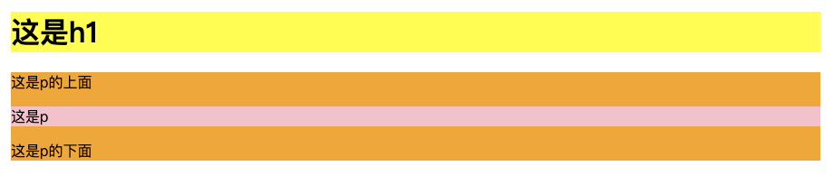
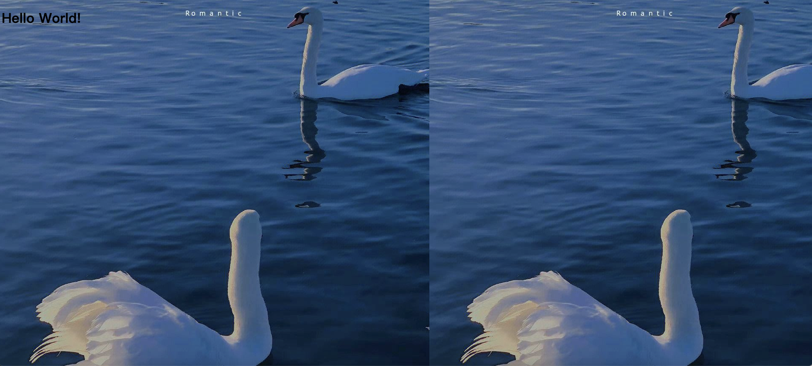
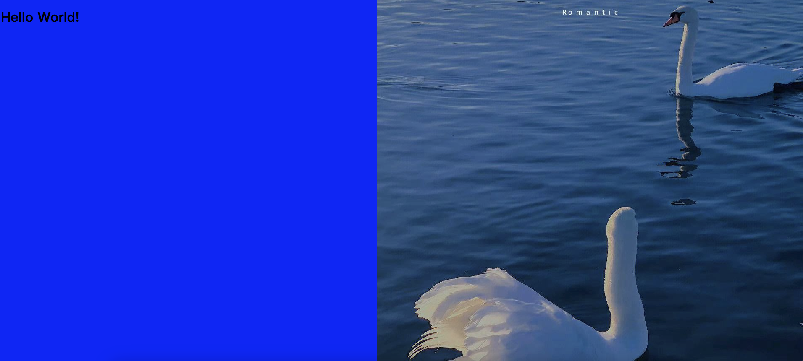

# Background

## body背景色

### 代码：


```html
<html>
<head>
<meta charset="utf-8"> 
<style>
body
{
	background-color:#128ce9;
}
</style>
</head>

<body>

<h1>这是H1</h1>
<p>这是P</p>

</body>
</html>
```

### 效果：


## 标签背景色


### 代码：


```html
<!DOCTYPE html>
<html>
<head>
<meta charset="utf-8"> 
<style>
h1
{
	background-color:yellow;
}
p
{
	background-color:pink;
}
div
{
	background-color:orange;
}
</style>
</head>

<body>

<h1>这是h1</h1>
<div>
这是p的上面
<p>这是p</p>
这是p的下面
</div>

</body>
</html>
```

### 效果：



## 背景图


### 代码：


```html
<!DOCTYPE html>
<html>
<head>
<meta charset="utf-8"> 
<style>
body 
{
	background-image:url('/Users/xxx/Downloads/back.jpeg');
	background-color:blue;
}
</style>
</head>

<body>
<h1>Hello World!</h1>
</body>

</html>
```

### 效果：


## repeat-x


图片水平平铺

### 代码：


```html
background-repeat:repeat-x;
```

### 效果：



## repeat-y


图片垂直平铺

### 代码：


```html
background-repeat:repeat-y;
```

### 效果：


## no-repeat

图片不平铺

### 代码：


```html
background-repeat:no-repeat;
```

### 效果：


## position


定位

### 代码：
```html
background-position:right top;
```

### 效果：
