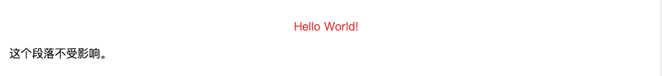
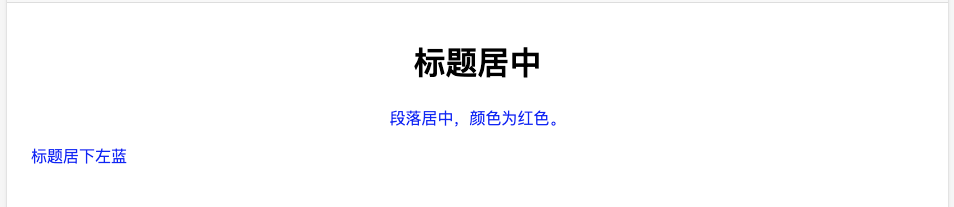

# CSS选择器

CSS选择器分为`ID选择器`跟`类选择器(Class选择器)`。


## ID选择器

### 代码：
```html
<html>
<head>
<meta charset="utf-8"> 
<style>
#iddd
{
	text-align:center;
	color:red;
} 
</style>
</head>

<body>
<p id="iddd">Hello World!</p>
<p>这个段落不受影响。</p>
</body>
</html>
```

### 显示效果：



## 类选择器

### 群体css样式（只要是当前class的都会使用这个样式）

#### 代码：
```html
<html>
<head>
<meta charset="utf-8"> 
<style>
.center
{
	text-align:center;
}
</style>
</head>

<body>
<h1 class="center">标题居中</h1>
<p class="center">段落居中。</p> 
</body>
</html>
```

#### 显示效果：


## 标签类选择样式

### 代码：
```html
<html>
<head>
<meta charset="utf-8">  
<style>
p.center
{
	text-align:center;
}
</style>
</head>

<body>
<h1 class="center">这个标题不受影响</h1>
<p class="center">这个段落居中对齐。</p> 
<p class="center1">这个段落居中对齐。</p> 
</body>
</html>
```

### 显示效果：


## 多个类选择器

### 代码：
```html
<html>
<head>
<meta charset="utf-8"> 
<style>
.center {
	text-align:center;
}
.color {
	color:blue;
}
</style>
</head>

<body>
<h1 class="center">标题居中</h1>
<p class="center color">段落居中，颜色为红色。</p> 
<p class="color">标题居下左蓝</p>
</body>
</html>
```

### 显示效果:
