# Github-Pages+GithubActions+Hexo自动部署+Hexo-client

之前一直用的`Hexo`手动部署
需要你手动的
```
hexo new "标题"
```
然后找个文本编辑器打开生成的`.md`文件，扒拉扒拉编辑完，如果想贴图，还得弄那种免费的图床软件，比较麻烦。
最近发现了2个好东西，一个是`Hexo-client`一个写`hexo`的客户端软件。虽然作者2年多不更新了，依旧很好用。再一个就是`GithubActions`。废话不多少，上教程。

# 一、Hexo-client
```
https://github.com/gaoyoubo/hexo-client
```
作者的github地址，选择右下的下载，最好选择`v1.3.5`版本，这个版本还支持`Github`的图床，然而`v1.3.6`就不支持图床了，一些不想弄七牛云、阿里云、腾讯云的对象存储的可以选择低版本。

```
https://www.mspring.org/2018/11/29/HexoClient使用帮助/
```
这个是如何使用`Hexo-client`的教程，作者自己写的，可以对着配置你的客户端。
PS：作者这个教程里面写的`Travis-CI`最好不要对照着配置，因为，`travis`要开始收费了，且你选择免费plan也需要绑定信用卡，银联的不可以，必须万事达或者JCB等。比较麻烦。且发布一次，需要消耗一定的积分，积分不够，就扣钱，比较恶心。我们用`GithubActions`就很好。

# 二、GithubActions
接下来，讲一讲如何使用`Github`的自动发布构建。
首先，生成一对密钥，作者在写这个`blog`的时候，用的是`Mac`

## 1、生成密钥
首先，执行这个命令，并且3次回车
```
ssh-keygen -f github-deploy-key -C "HEXO CD"
```

PS：我的`Hexo`的博客是分仓库的，分了两个仓库，一个是原文，一个是构建之后的。
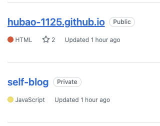

`hubao-1125.github.io`这个是发布之后的`Pages`的，所以仓库权限是公共的
`self-blog`是我写的内容，设置的是私有的。

## 2、上传密钥

### a)上传私钥
首先，找到`self-blog`这个项目（这是我自己写的博客内容的，换成大家的就是你们自己的博客内容的仓库）
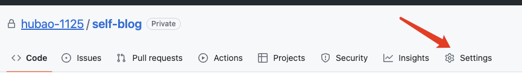
点击`Settings`
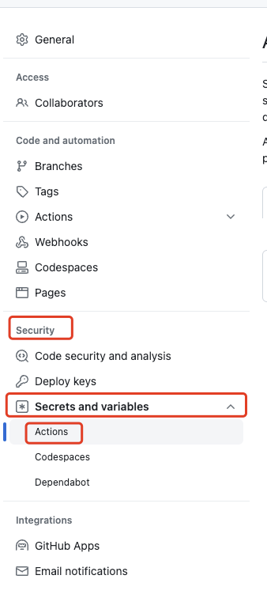
在`Security`的`Secrets and variables`的`Actions`，点击`Actions`
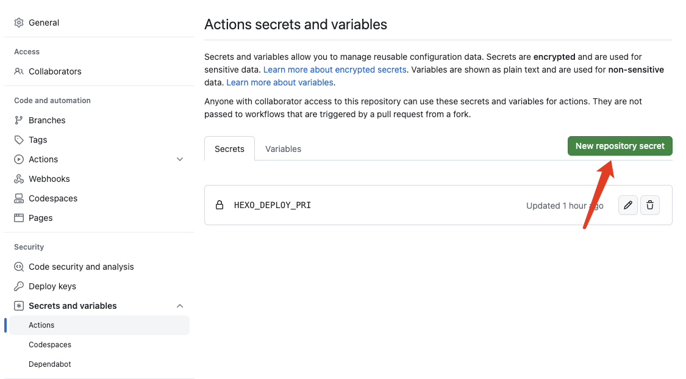
点击`New repository secret`
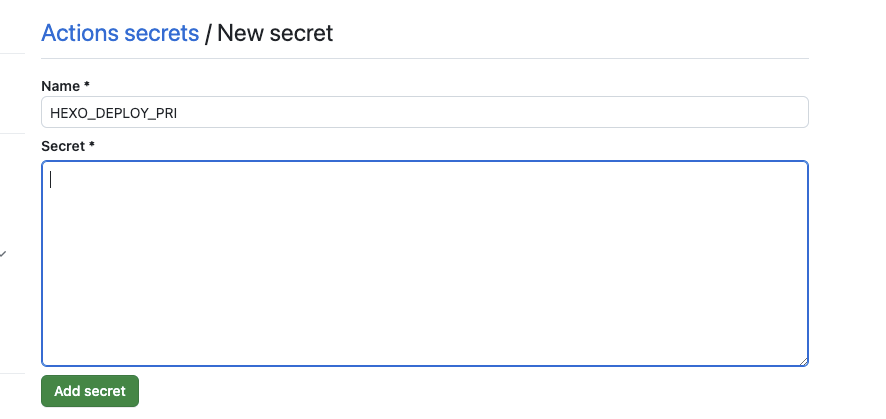
名称可以随便起，我这里的名称叫做`HEXO_DEPLOY_PRI`，然后把你的私钥粘贴进去，点击`Add secret`保存即可。

### b)上传公钥
找到`hubao-1125.github.io`项目
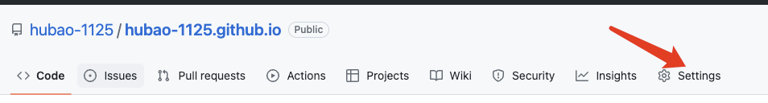
点击`Settings`
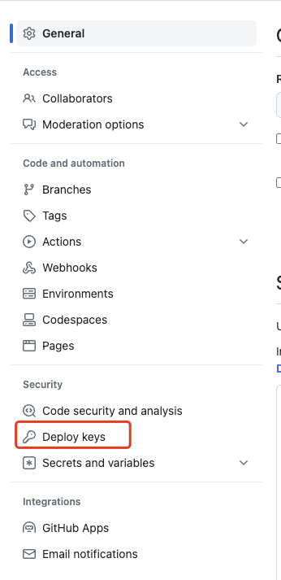
在`Security`下的`Deploy keys`，点击`Deploy keys`。
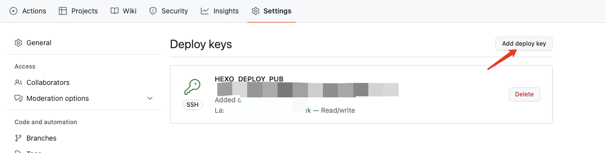
点击`Add deploy key`
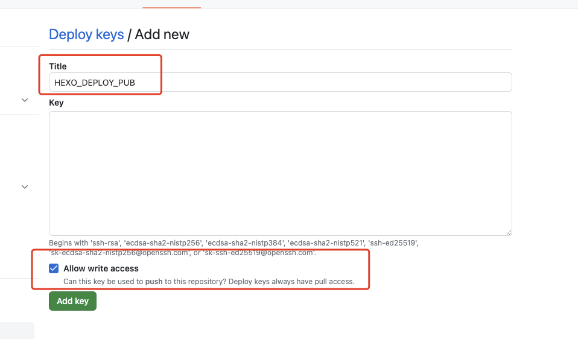
把你的公钥填写进去，名称我这里叫做`HEXO_DEPLOY_PUB`，记住一定要对`Allow write access`打勾，然后点击`Add key`保存即可。

## 3、配置Actions

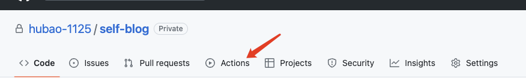
点击`Actions`
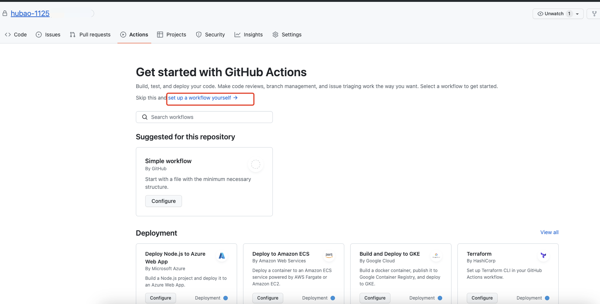
默认没配置过`Actions`的项目界面是这样的，会给你一些推荐，我这里用的是我别的没有配置过`Actions`的项目做的演示。点击`set up a workflow yourself`
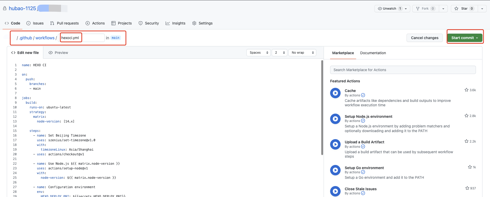
首先，给你的`yml`文件起个名称，我就叫做`hexoci.yml`了。
他会在你的项目根目录下面创建一个文件夹`.github`，在这个文件夹里面还有个文件夹`workflow`，在这个文件夹里面才是你的`hexoci.yml`文件，具体文本里的内容如下，注意几个地方，需要修改成你自己的。

`blog_source_branch`修改成你自己的源分支
`username`修改成你自己的提交名称
`username@email.address`修改成你自己的邮箱
`username`跟`username@email.address`，建议最好修改为你自己本地的`git`配置的`username`跟`username@email.address`。

```
name: HEXO CI
 
on:
  push:
    branches:
    - <blog_source_branch>
 
jobs:
  build:
    runs-on: ubuntu-latest
    strategy:
      matrix:
        node-version: [14.x]
 
    steps:
      - name: Set Beijing Timezone
        uses: szenius/set-timezone@v1.0
        with:
          timezoneLinux: Asia/Shanghai
      - uses: actions/checkout@v1
 
      - name: Use Node.js ${{ matrix.node-version }}
        uses: actions/setup-node@v1
        with:
          node-version: ${{ matrix.node-version }}
 
      - name: Configuration environment
        env:
          HEXO_DEPLOY_PRI: ${{secrets.HEXO_DEPLOY_PRI}}
        run: |
          mkdir -p ~/.ssh/
          echo "$HEXO_DEPLOY_PRI" > ~/.ssh/id_rsa
          chmod 600 ~/.ssh/id_rsa
          ssh-keyscan github.com >> ~/.ssh/known_hosts
          git config --global user.name "<username>"
          git config --global user.email "<username@email.address>"
      - name: Install dependencies
        run: |
          npm i -g hexo-cli
          npm i
      - name: Deploy hexo
        run: |
          hexo clean && hexo generate && hexo deploy
```
复制进去之后，直接点击`Start commit`进行提交。
PS：借鉴的大佬的博客里面，没有针对时区的内容。脚本里面有增加了每次构建，对时区的确定，否则每次构建之后对应构建项目的`git`提交信息会比国内晚8小时。

提交完成之后就会进行第一次构建。
之后，你的每次提交，都会触发自动构建
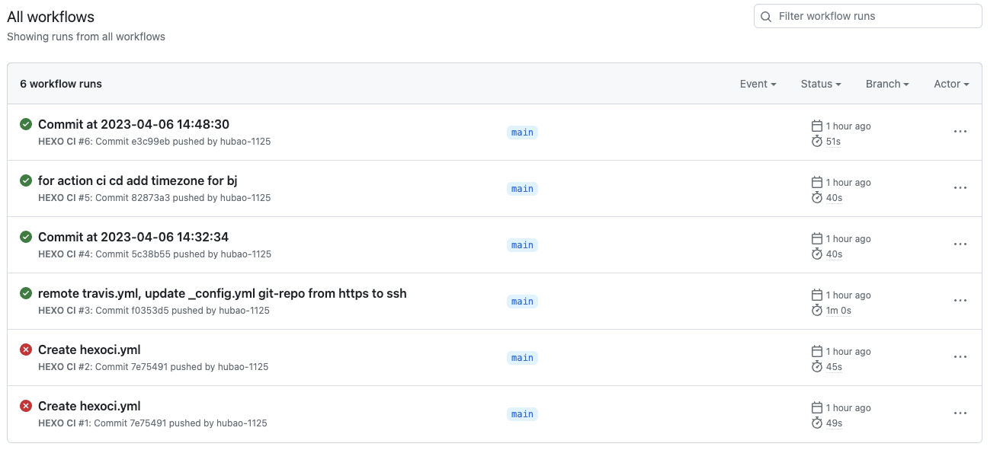
每次提交后的构建如图，红叉叉的是初始构建的脚本有问题，后续修改正确之后，就不用动了，基本就是ok了。

在你的`_config.yml`中，有部署相关的，最好修改为`ssh`的
```
deploy:
  type: 'git'
  repo: git@github.com:hubao-1125/hubao-1125.github.io.git
  branch: master
```

最后感谢一下一位大佬的博客，本文部分内容是借鉴了大佬的博客内容，由于大佬有一些地方写的不清晰，所以，我自己在调试过程中更新了部分内容。
```
https://blog.csdn.net/jggnice/article/details/124773430
```