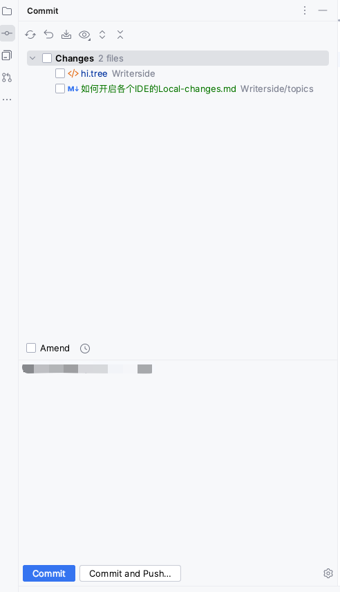
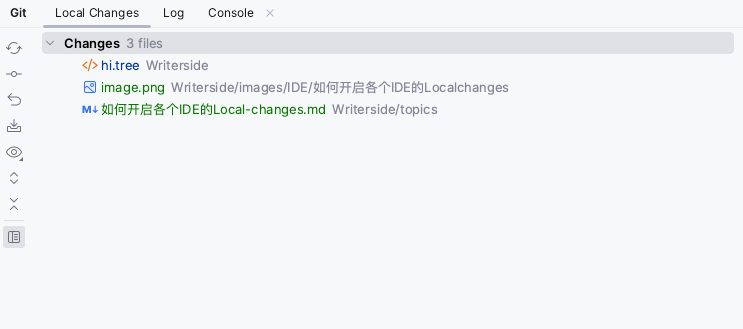
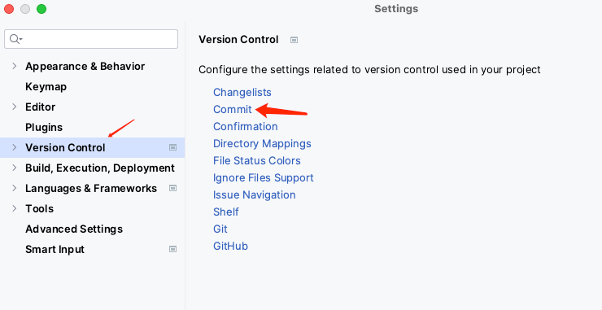
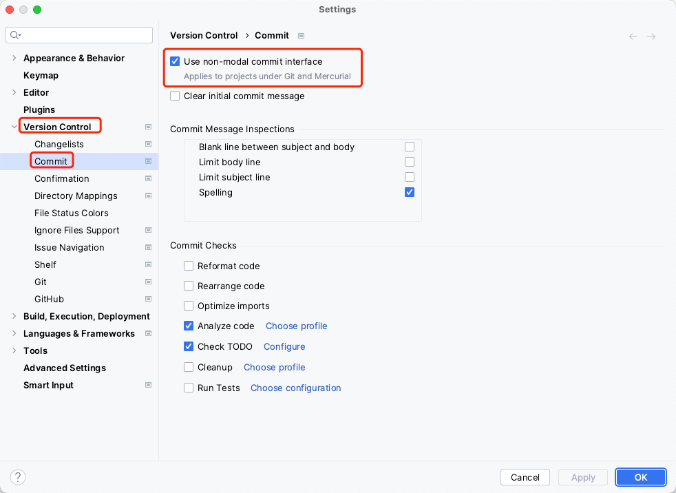
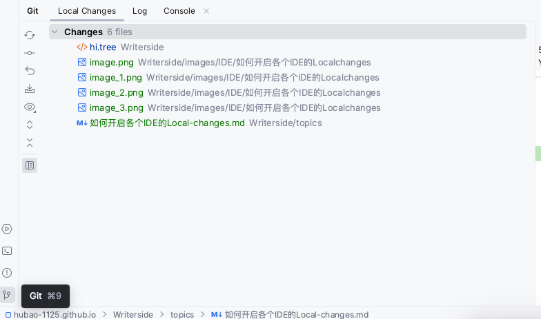

# 如何开启各个IDE的Localchanges

现在大部分开发用的都是`Jetbrains`的工具。

下面的这个默认自带的Commit是不是很难用，还很难受。

那么，怎么像下面这样呢。

打开你的`IDE`设置。`Mac`的快捷键设置是`Command + ,`

找到`Version Control`的`Commit`，点进去。

一般如果没有最开始的配置的话，红框圈选的那个配置项默认是选中的，也就是`Use non-modal commit interface`，`使用非模态提交接口`。

把他点掉，你的`Git`栏就会出现`Local Changes`了。

