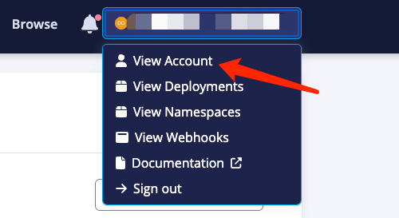
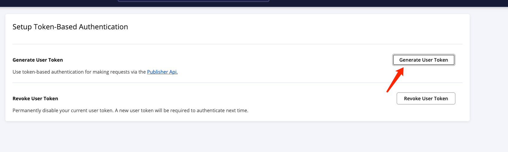
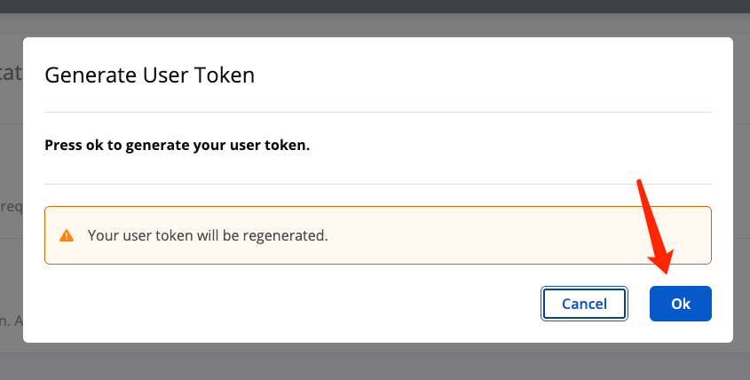

# 开源推送 jar 包到 Maven 中央仓库

最近在搞个支付开源，然后，就寻思，怎么把包推送到`maven`中央仓库。网上搜了一圈，大部分都是旧的教程，不是新的。

我搞定了之后，记录一下。

## central&NXRM

首先说一下，`maven`中央仓库的包，主要来源于`sonatype`，他们一直对全球的`maven`中央仓库提供支持。

然后，他们于`2024`年更换了新的中央仓库推送方式。由原先的`NXRM`改为了`central`。

[官方文档](https://central.sonatype.org/register/central-portal/)

上面是文档地址，接下来开始。

## gpg
推送包到中央仓库，是需要知道你的身份的，还需要做一些加密，使用的是`gpg`，这里假设你本机没有`gpg`，同时你也对`gpg`不清楚。

[sonatype对 gpg操作文档](https://central.sonatype.org/publish/requirements/gpg/)

### 安装
首先安装`gpg`，[gpg下载](https://gnupg.org/download/index.html#sec-1-2) 下载合适自己系统的`gpg`，最好选择`.exe`或者`.dmg`的那种自动安装。

安装完成之后，需要生成`gpg密钥`。

#### 生成
```Shell
gpg --gen-key
```
这里密钥生成过程中会需要你的`name`和`email`，还需要设置密码

#### 查看
生成之后，查看，目前应该是只有一个

这里我借用官方文档的示例了

```Shell
gpg --list-keys

/home/mylocaluser/.gnupg/pubring.kbx
---------------------------------
pub   rsa3072 2021-06-23 [SC] [expires: 2023-06-23]
      CA925CD6C9E8D064FF05B4728190C4130ABA0F98
uid           [ultimate] Central Repo Test <central@example.com>
sub   rsa3072 2021-06-23 [E] [expires: 2023-06-23]
```

#### 发布
```Shell
gpg --keyserver keyserver.ubuntu.com --send-keys CA925CD6C9E8D064FF05B4728190C4130ABA0F98
```
这里需要注意一下，`--send-keys`后面有空格，然后是你的密钥，也就是上面查看里面的`pub`下面那一串，这里是`CA925CD6C9E8D064FF05B4728190C4130ABA0F98`

实际上更换为你的发布上去即可。

PS：官方配置教程里有指定密钥，那个是因为你本地有多个`gpg`密钥，默认是用的第一个，如果你存在多个，想使用第一个之后的，则需要去指定`name`和密钥了，否则
不需要指定密钥。


## maven settings.xml
这里咱们发布选择使用本地`idea`的`maven`进行构建。所以，需要设置`maven`的相关信息。其实，很简单，没有特别麻烦。

### servers
```Shell
<servers>
    <server>
      <id>serverid</id>
      <username>username</username>
      <password>password</password>
    </server>
</servers>
```
这里的是`servers`标签里的，按照层级逐一解释，先是`server`
`id`是`server`的`id`，这里要跟下面的`pom.xml`里的`id`对得上，最简单的办法，`id`就是`central`

`username`就是在新网站上的生成的`token`
`password`也是在新网站上生成的

如下图：









生成好之后，配置在你`idea`里指定的`settings.xml`里


### profiles
```
<profiles>
    <profile>
      <id>ossrh</id>
      <activation>
        <activeByDefault>true</activeByDefault>
      </activation>
      <properties>
        <gpg.executable>/usr/local/bin/gpg</gpg.executable>
        <gpg.passphrase>the_pass_phrase</gpg.passphrase>
      </properties>
    </profile>
</profiles>
```

这里`id`和`activeByDefault`的不动，就这么填写。`properties里的逐级解释。

`gpg.executable`填写的是你本地`gpg`安装的路径，官方上面写的是`gpg2`，但是，并不起作用。

`gpg.passphrase`不动，官方写的就是`the_pass_phrase`

## pom.xml
你的`pom`里面也需要配置一些东西，如下。

### licenses
```Shell
    <licenses>
        <license>
            <name>The Apache License, Version 2.0</name>
            <url>http://www.apache.org/licenses/LICENSE-2.0.txt</url>
        </license>
    </licenses>
```
`licenses`这个不动，都是官方的

### developers
```Shell
    <developers>
        <developer>
            <name>xxx</name>
            <email>xxx@gmail.com</email>
            <organization>Sonatype</organization>
            <organizationUrl>xxx.github.io</organizationUrl>
        </developer>
    </developers>
```

`developers` 里要填写

`name` 是开发者姓名

`email` 是你的邮箱

`organization` 就写Sonatype

`organizationUrl` 一般写归属组织的官网地址，不过咱们自己开源多半都是个人，可以填写自己的github地址
    

### scm
```Shell
    <scm>
        <connection>scm:git:git://github.com/simpligility/ossrh-demo.git</connection>
        <developerConnection>scm:git:ssh://github.com:simpligility/ossrh-demo.git</developerConnection>
        <url>http://github.com/simpligility/ossrh-demo/tree/master</url>
    </scm>
```

`scm`我也不知道是啥，所以保持不动。
    
### 其他信息

```Shell
    <name>${project.artifactId}</name>
    <description>xxx  jar</description>
    <url>xxx.github.io</url>
```

`name` 就是项目的`artifactId`
`description` 描述项目包信息
`url` 也是填写你自己的网站地址


### 插件
```Shell
    <build>
        <plugins>
            <plugin>
                <groupId>org.apache.maven.plugins</groupId>
                <artifactId>maven-compiler-plugin</artifactId>
                <version>3.8.1</version>
                <configuration>
                    <source>1.8</source>
                    <target>1.8</target>
                    <encoding>UTF-8</encoding>
                </configuration>
            </plugin>
            <plugin>
                <groupId>org.springframework.boot</groupId>
                <artifactId>spring-boot-maven-plugin</artifactId>
                <version>${spring-boot.version}</version>
                <configuration>
                    <skip>true</skip>
                </configuration>
                <executions>
                    <execution>
                        <id>repackage</id>
                        <goals>
                            <goal>repackage</goal>
                        </goals>
                    </execution>
                </executions>
            </plugin>

            <plugin>
                <groupId>org.apache.maven.plugins</groupId>
                <artifactId>maven-source-plugin</artifactId>
                <version>2.2.1</version>
                <executions>
                    <execution>
                        <id>attach-sources</id>
                        <goals>
                            <goal>jar-no-fork</goal>
                        </goals>
                    </execution>
                </executions>
            </plugin>
            <plugin>
                <groupId>org.apache.maven.plugins</groupId>
                <artifactId>maven-javadoc-plugin</artifactId>
                <version>2.9.1</version>
                <executions>
                    <execution>
                        <id>attach-javadocs</id>
                        <goals>
                            <goal>jar</goal>
                        </goals>
                    </execution>
                </executions>
            </plugin>

            <plugin>
                <groupId>org.apache.maven.plugins</groupId>
                <artifactId>maven-gpg-plugin</artifactId>
                <version>1.6</version>
                <executions>
                    <execution>
                        <id>sign-artifacts</id>
                        <phase>verify</phase>
                        <goals>
                            <goal>sign</goal>
                        </goals>
                    </execution>
                </executions>
            </plugin>

            <plugin>
                <groupId>org.sonatype.central</groupId>
                <artifactId>central-publishing-maven-plugin</artifactId>
                <version>0.4.0</version>
                <extensions>true</extensions>
                <configuration>
                    <publishingServerId>central</publishingServerId>
                    <tokenAuth>true</tokenAuth>
                    <centralBaseUrl>https://central.sonatype.com</centralBaseUrl>
                    <deploymentName>${project.artifactId}</deploymentName>
                </configuration>
            </plugin>
        </plugins>
    </build>
```

前面几个插件没啥好说的，主要说`org.sonatype.central`插件的`configuration`

`publishingServerId` 就是刚才你在`maven`的`settings.xml`里`servers`里的`server`的`id`，要对的上

`tokenAuth` 使用`token`来进行交互

`centralBaseUrl` 中央仓库提交地址，其实不写也行，不写默认就是`https://central.sonatype.com`

`deploymentName` 发布者名称，这里可以填写你自己，也可以写项目的`artifactId`

## maven 本地发布
以上都配置完之后，则可以在本地用`idea`的`maven`进行`deploy`，也可以自己写命令执行 `mvn clean deploy`

## central页面操作


一般发布完之后，如图，状态是`VALIDATED`，点击旁边的`Publish`进入发布审核状态，审核通过后就是`PUBLISHED`了。

其实，按照官方文档来操作不难，就是有的可能没搞过，或者说都是往公司的`nexus`上推二方库，感觉陌生。再加上`SonaType`最近在搞`central`和`NXRM`的双轨并行，
所以，我们才会觉得好麻烦。